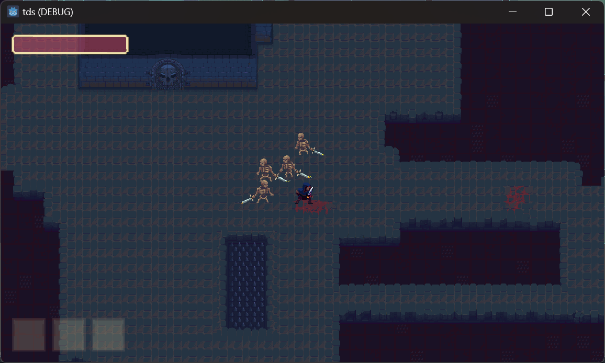

# The Elden Square

A souls-like action RPG featuring procedural generation built with Godot 4.

## Overview

The Elden Square combines souls-like combat mechanics with procedurally generated dungeons, offering a unique experience with each playthrough. The game is built using the Godot 4 engine with GDScript.

## Core Features

### Procedural World Generation
- Multi-layered procedural dungeon generation
- Tree-based room layout system
- Interconnected paths with alternate routes

### Combat System
- Precise, timing-based combat mechanics
- Diverse weapon selection:
  - Close-range melee weapons
  - Long-range bow combat
  - Unique weapon movesets
- Advanced targeting system
- Tactical dodge and roll maneuvers

### Character Systems
- Customizable player loadouts
- Equipment-based stat system
- Multiple enemy types:
  - Melee skeletons
  - Ranged mage skeletons
  - Assassin-type enemies
- Comprehensive inventory management
